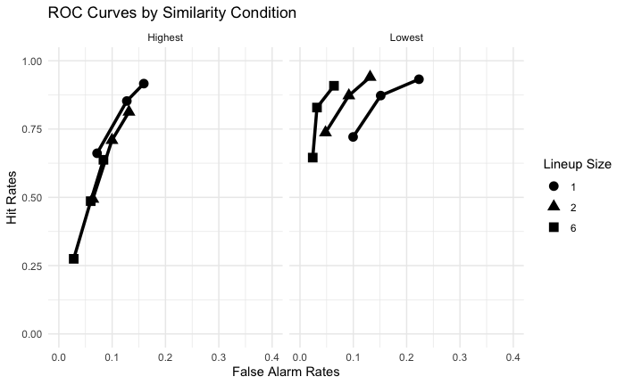
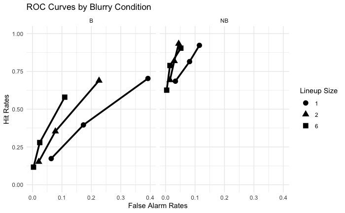
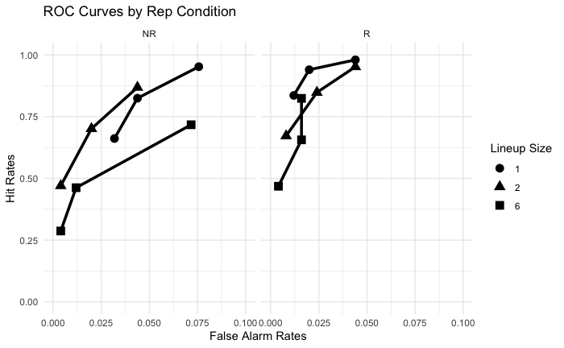

#  Eyewitness Memory & Lineup Optimization: The Role of Filler Similarity and Size 🧠
---

##  The Challenge: Optimizing Eyewitness Discriminability

The core challenge in eyewitness research is optimizing police photo lineups (showups, 2-person, 6-person) to maximize witness **discriminability** (the ability to correctly identify a guilty suspect while avoiding false alarms). Although studies showed that optimal lineup size varies with filler similarity, the influence of the **witness's memory strength (encoding)** on this interaction was unknown.

This research aimed to determine whether the optimal lineup size is dependent on the strength of the witness's initial memory encoding (tested via repetition/unrepetition) when fillers are of either high or low similarity.

---

## Key Data-Driven Insights

The analysis used **Signal Detection Theory** to calculate discriminability ($d'_{IG}$) and fitted the data to the **Independent Observations (IO) Model** to test theoretical predictions, revealing a critical interaction:

1. The Crucial Interaction: Similarity $\times$ Size
- **High Similarity Fillers**: Discriminability ($d'_{IG}$) decreased significantly as the lineup size increased (from 1 to 6 persons).
- **Low Similarity Fillers**: Discriminability increased significantly as the lineup size increased (from 1 to 6 persons).

  
   
  <em>Figure: Discriminability by Lineup Size and Similarity </em>

2. Independence from Encoding Strength
- **Finding**: The effect of lineup size on discriminability was completely independent of the encoding manipulation (repeated vs. unrepeated target viewing). The same interaction pattern (finding 1) was observed regardless of the initial strength of the witness's memory.
- **Implication**: Interventions aimed at improving initial memory encoding (e.g., better lighting) will not change the fundamental decision of which lineup size to use.

  

  
   
  <em>Figure: Discriminability by Lineup Size and Encoding Manipulations </em>

---

## Actionable Recommendation
**Strategy**: Standardize the use of multi-person lineups with fillers that strictly match the witness's verbal description to maximize discriminability.
- **Administer Multi-Person Lineups (instead of Showups)**: Formalize the use of lineups with multiple fillers (more than 1 person) as the standard police procedure, if possible. 
- **Prioritize Descriptive Matching**: Emphasize that filler selection must be based on matching the witness’s verbal description of the perpetrator, not merely matching the suspect’s appearance. This creates a functionally low-similarity lineup environment among the non-suspects, a condition which is empirically shown to increase discriminability.
- **Optimal Size for Descriptively Matched Fillers**: When utilizing these descriptively matched, low-similarity fillers, police should default to the larger lineup sizes (e.g., 6-person), as our findings confirm this significantly increases eyewitness discriminability.

---

## Conclusion & Next Steps

This study establishes that the optimal lineup size depends critically on **filler similarity** and is robust to manipulations of encoding strength, providing key guidance for law enforcement policy.

- **Next Steps**:  Future research should test other encoding manipulations, such as the duration of target viewing, to confirm the generalizability of the encoding independence finding.

---

[ **Full Analysis Report**: [Publication.pdf](./Publication.pdf) | **Analysis Scripts**: [Exp1_ROC.Rmd](./Analysis/Exp1_ROC.Rmd) | [Exp2_ROC.Rmd](./Analysis/Exp2_ROC.Rmd) | [Exp3_ROC.Rmd](./Analysis/Exp3_ROC.Rmd)

